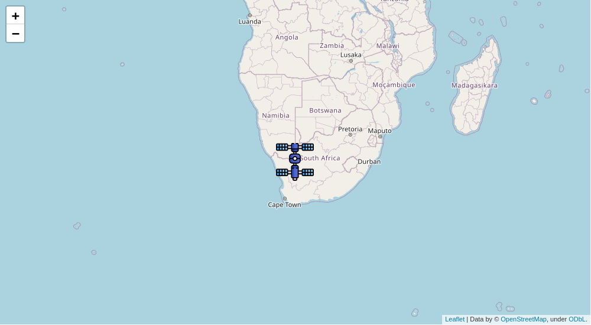

# Space Station Locator
## Track the location of the International Space Station
This application uses an API from http://open-notify.org/ and GeoPy to track the location of the ISS and let the user know what country it is above.




## Quickstart Guide
1.  ```
    pip install -r requirements.txt
    ```
2. In ``.env`` add ``SECRET_KEY={your Django secret key}``